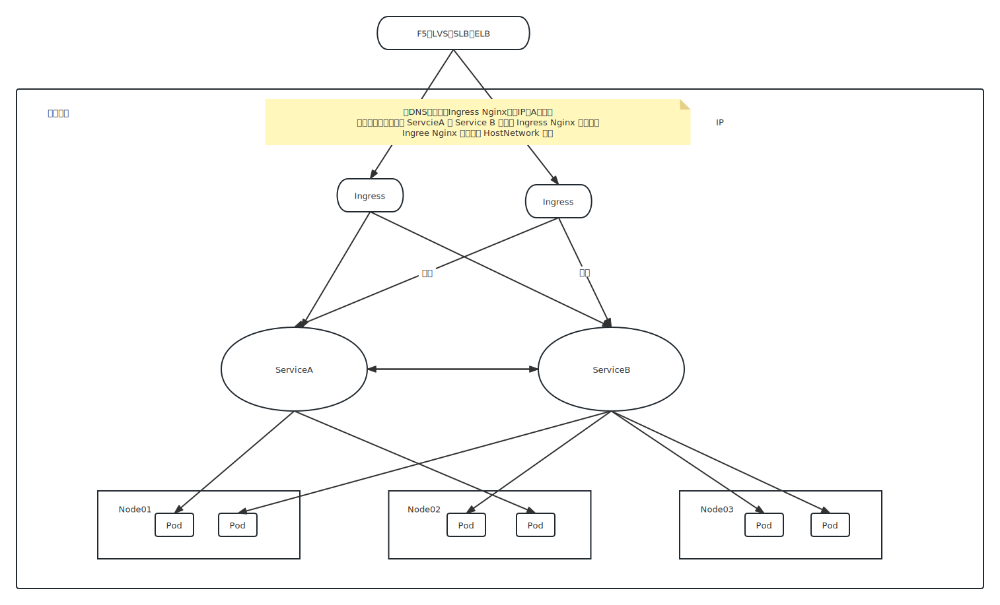

Ingress 也是 k8s 的资源类型，ingress 用于实现用域名的方式访问 k8s 内部应用.



- Chart: Helm 包，包含在 Kubernetes 集群内部运行应用程序，工具或者服务所需的所有资源定义。
- Repository: 仓库，用来存放和共享 charts 的地方
- Release: 运行在 k8s 集群中的 chart 示例。一个 chart 通常可以在一个集群中安装多次。每次安装都会创建一个新的 release。

## ingress nginx 安装
```yaml
# 安装第三方仓库
helm repo add ingress-nginx https://kubernetes.github.io/ingress-nginx

# 仓库查看
sfqfs@sfq:~/k8s$ helm repo list
NAME            URL
ingress-nginx   https://kubernetes.github.io/ingress-nginx
test            https://kubernetes.github.io/ingress-nginx

# chart 查找
sfqfs@sfq:~/k8s$ helm search repo ingress-nginx
NAME                            CHART VERSION   APP VERSION     DESCRIPTION
ingress-nginx/ingress-nginx     4.5.2           1.6.4           Ingress controller for Kubernetes using NGINX a...
test/ingress-nginx              4.5.2           1.6.4           Ingress controller for Kubernetes using NGINX a...

# chart 下载到本地
sfqfs@sfq:~/k8s$ helm pull ingress-nginx/ingress-nginx
sfqfs@sfq:~/k8s$ ls -l ingress-nginx-4.5.2.tgz
-rw-r--r-- 1 sfqfs sfqfs 46009 Mar 13 14:01 ingress-nginx-4.5.2.tgz

# 解压
sfqfs@sfq:~/k8s$ tar xf ingress-nginx-4.5.2.tgz
sfqfs@sfq:~/k8s$ ls ingress-nginx
CHANGELOG.md  Chart.yaml  OWNERS  README.md  README.md.gotmpl  changelog  changelog.md.gotmpl  ci  templates  values.yaml
sfqfs@sfq:~/k8s$

```

修改 `values.yaml`

1. 修改镜像地址（image）
2. `hostNetwork: true` （使用主机网络）
3. dnsPolicy: ClusterFirstWithHostNet (和 hostNetwork: true 配合使用，优先使用集群内部的域名解析)
4. 使用 `kind: DaemonSet` 方式部署，可以固定到某些节点，外部负载均衡可以直接代理到这几台机器上
5. nodeSelector 配置一下需要选择哪些节点
    ```yaml
    nodeSelector:
          kubernetes.io/os: linux
          ingress: true
    ```
6. resource 配置
7. service`.type = LoadBalancer` 改为 `service.type = ClusterIP` 因为本身就是通过宿主机的 IP 来访问了
8. 部署 ingress
    ```bash
    sfqfs@sfq:~/k8s/ingress-nginx$ kubectl create ns ingress-nginx
    namespace/ingress-nginx created

    sfqfs@sfq:~/k8s/ingress-nginx$ helm install ingress-nginx -n ingress-nginx .
    NAME: ingress-nginx
    LAST DEPLOYED: Mon Mar 13 15:48:15 2023
    NAMESPACE: ingress-nginx
    STATUS: deployed
    REVISION: 1
    TEST SUITE: None
    NOTES:
    The ingress-nginx controller has been installed.
    Get the application URL by running these commands:
      export POD_NAME=$(kubectl --namespace ingress-nginx get pods -o jsonpath="{.items[0].metadata.name}" -l "app=ingress-nginx,component=controller,release=ingress-nginx")
      kubectl --namespace ingress-nginx port-forward $POD_NAME 8080:80
      echo "Visit http://127.0.0.1:8080 to access your application."

    An example Ingress that makes use of the controller:
      apiVersion: networking.k8s.io/v1
      kind: Ingress
      metadata:
        name: example
        namespace: foo
      spec:
        ingressClassName: nginx
        rules:
          - host: www.example.com
            http:
              paths:
                - pathType: Prefix
                  backend:
                    service:
                      name: exampleService
                      port:
                        number: 80
                  path: /
        # This section is only required if TLS is to be enabled for the Ingress
        tls:
          - hosts:
            - www.example.com
            secretName: example-tls

    If TLS is enabled for the Ingress, a Secret containing the certificate and key must also be provided:

      apiVersion: v1
      kind: Secret
      metadata:
        name: example-tls
        namespace: foo
      data:
        tls.crt: <base64 encoded cert>
        tls.key: <base64 encoded key>
      type: kubernetes.io/tls
    ```
9.  给一个节点附加 `ingress=true` 来触发 pod ingress-nginx 安装
    ```bash
    # 查看当前 pod
    sfqfs@sfq:~/k8s$ kubectl get pod -A -owide
    NAMESPACE     NAME                                      READY   STATUS    RESTARTS        AGE     IP          NODE           NOMINATED NODE   READINESS GATES
    kube-system   coredns-5cfbb9f57c-l7xh5                  1/1     Running   0               7d14h   10.42.0.3   node1.sfq.me   <none>           <none>
    kube-system   local-path-provisioner-5f8bbd68f9-nhwbw   1/1     Running   0               7d14h   10.42.0.2   node1.sfq.me   <none>           <none>
    default       nginx-deployment-7bf89ffbcd-d29qq         1/1     Running   0               7d5h    10.42.4.7   node4.sfq.me   <none>           <none>
    minio-dev     minio                                     1/1     Running   0               7d      10.42.4.8   node4.sfq.me   <none>           <none>
    default       nginx-deployment-7bf89ffbcd-5s6sm         1/1     Running   0               7d3h    10.42.1.9   node2.sfq.me   <none>           <none>
    kube-system   metrics-server-847dcc659d-9dkrw           1/1     Running   1 (6d21h ago)   7d12h   10.42.1.7   node2.sfq.me   <none>           <none>
    default       busybox                                   1/1     Running   73 (51m ago)    7d3h    10.42.1.8   node2.sfq.me   <none>           <none>

    # 在 node4 上安装 ingress-nginx
    sfqfs@sfq:~/k8s$ kubectl label node node4.sfq.me ingress=true
    node/node4.sfq.me labeled

    # 查看 ingress-nginx 安装成功
    sfqfs@sfq:~/k8s$ kubectl get pod -A -owide -w
    NAMESPACE       NAME                                      READY   STATUS    RESTARTS        AGE     IP           NODE           NOMINATED NODE   READINESS GATES
    kube-system     coredns-5cfbb9f57c-l7xh5                  1/1     Running   0               7d14h   10.42.0.3    node1.sfq.me   <none>           <none>
    kube-system     local-path-provisioner-5f8bbd68f9-nhwbw   1/1     Running   0               7d14h   10.42.0.2    node1.sfq.me   <none>           <none>
    default         nginx-deployment-7bf89ffbcd-d29qq         1/1     Running   0               7d5h    10.42.4.7    node4.sfq.me   <none>           <none>
    minio-dev       minio                                     1/1     Running   0               7d      10.42.4.8    node4.sfq.me   <none>           <none>
    default         nginx-deployment-7bf89ffbcd-5s6sm         1/1     Running   0               7d3h    10.42.1.9    node2.sfq.me   <none>           <none>
    kube-system     metrics-server-847dcc659d-9dkrw           1/1     Running   1 (6d21h ago)   7d12h   10.42.1.7    node2.sfq.me   <none>           <none>
    default         busybox                                   1/1     Running   73 (53m ago)    7d3h    10.42.1.8    node2.sfq.me   <none>           <none>
    ingress-nginx   ingress-nginx-controller-psnvh            0/1     Running   0               16s     10.42.4.10   node4.sfq.me   <none>           <none>
    ingress-nginx   ingress-nginx-controller-psnvh            1/1     Running   0               20s     10.42.4.10   node4.sfq.me   <none>           <none>

    ```
10. 在节点 node4 上可以看到宿主机监听的端口
    ```yaml
    [sfq@node4 ~]$ sudo  netstat -ltpn | grep -E  "80|443"
    [sudo] password for sfq:
    tcp        0      0 0.0.0.0:80              0.0.0.0:*               LISTEN      31687/nginx: master
    tcp        0      0 0.0.0.0:443             0.0.0.0:*               LISTEN      31687/nginx: master
    tcp6       0      0 :::80                   :::*                    LISTEN      31687/nginx: master
    tcp6       0      0 :::8443                 :::*                    LISTEN      31631/nginx-ingress
    tcp6       0      0 :::443                  :::*                    LISTEN      31687/nginx: master
    [sfq@node4 ~]$ ps aux  | grep nginx
    root      18630  0.0  0.0   8920  3484 ?        Ss   Mar09   0:00 nginx: master process nginx -g daemon off;
    101       18683  0.0  0.0   9308  1772 ?        S    Mar09   0:01 nginx: worker process
    101       18684  0.0  0.0   9308  1776 ?        S    Mar09   0:01 nginx: worker process
    101       31619  0.0  0.0    200     4 ?        Ss   03:59   0:00 /usr/bin/dumb-init -- /nginx-ingress-controller --publish-service=ingress-nginx/ingress-nginx-controller --election-id=ingress-nginx-leader --controller-class=k8s.io/ingress-nginx --ingress-class=nginx --configmap=ingress-nginx/ingress-nginx-controller --validating-webhook=:8443 --validating-webhook-certificate=/usr/local/certificates/cert --validating-webhook-key=/usr/local/certificates/key
    101       31631  0.2  0.7 754080 35480 ?        Ssl  03:59   0:02 /nginx-ingress-controller --publish-service=ingress-nginx/ingress-nginx-controller --election-id=ingress-nginx-leader --controller-class=k8s.io/ingress-nginx --ingress-class=nginx --configmap=ingress-nginx/ingress-nginx-controller --validating-webhook=:8443 --validating-webhook-certificate=/usr/local/certificates/cert --validating-webhook-key=/usr/local/certificates/key
    101       31687  0.0  0.7 146860 35432 ?        S    03:59   0:00 nginx: master process /usr/bin/nginx -c /etc/nginx/nginx.conf
    101       31692  0.0  0.7 158892 39704 ?        Sl   03:59   0:00 nginx: worker process
    101       31693  0.0  0.8 158996 40544 ?        Sl   03:59   0:00 nginx: worker process
    101       31694  0.0  0.5 144804 28456 ?        S    03:59   0:00 nginx: cache manager process
    sfq       32352  0.0  0.0 112812   976 pts/0    S+   04:16   0:00 grep --color=auto nginx
    [sfq@node4 ~]$
    ```
11. 配置 Nginx

12. 创建 servicea、serviceb

    ```yaml
    apiVersion: v1
    kind: Service
    metadata:
      name: servicea
      namespace: ingress-nginx
    spec:
      selector:
        app: servicea
      ports:
        - name: http
          port: 8080
      type: ClusterIP
    ---
    apiVersion: v1
    kind: Service
    metadata:
      name: serviceb
      namespace: ingress-nginx
    spec:
      selector:
        app: serviceb
      ports:
        - name: http
          port: 8080
      type: ClusterIP
    ```

13. 配置 ingress-nginx(servicea.sfq.me, serviceb.sfq.me 的IP都配置到 ingress-nginx pod 使用主机网络的那台机器)

    ```yaml
    apiVersion: networking.k8s.io/v1
    kind: Ingress
    metadata:
      name: ingress-myservicea
      namespace: ingress-nginx
    spec:
      rules:
      - host: servicea.sfq.me
        http:
          paths:
          - path: /servicea
            pathType: Prefix
            backend:
              service:
                name: servicea
                port:
                  number: 8080
      ingressClassName: nginx
    ---
    apiVersion: networking.k8s.io/v1
    kind: Ingress
    metadata:
      name: ingress-myserviceb
      namespace: ingress-nginx
    spec:
      rules:
      - host: serviceb.sfq.me
        http:
          paths:
          - path: /serviceb
            pathType: Prefix
            backend:
              service:
                name: serviceb
                port:
                  number: 8080
      ingressClassName: nginx
    ```
14. 测试
    ```yaml
    # 访问 ingress-nginx 的 pod 对应宿主机
    sfqfs@sfq:~/k8s$ kubectl get svc -n ingress-nginx -o wide
    NAME                                 TYPE        CLUSTER-IP      EXTERNAL-IP   PORT(S)          AGE     SELECTOR
    ingress-nginx-controller-admission   ClusterIP   10.43.200.115   <none>        443/TCP          3h37m   app.kubernetes.io/component=controller,app.kubernetes.io/instance=ingress-nginx,app.kubernetes.io/name=ingress-nginx
    ingress-nginx-controller             ClusterIP   10.43.163.111   <none>        80/TCP,443/TCP   3h37m   app.kubernetes.io/component=controller,app.kubernetes.io/instance=ingress-nginx,app.kubernetes.io/name=ingress-nginx
    servicea                             ClusterIP   10.43.130.154   <none>        8080/TCP         12m     app=servicea
    serviceb                             ClusterIP   10.43.97.133    <none>        8080/TCP         4m25s   app=serviceb,namespace=ingress-nginx

    # 访问服务A
    sfqfs@sfq:~/k8s$ curl -v servicea.sfq.me/servicea
    *   Trying 192.168.0.204:80...
    * TCP_NODELAY set
    * Connected to servicea.sfq.me (192.168.0.204) port 80 (#0)
    > GET /servicea HTTP/1.1
    > Host: servicea.sfq.me
    > User-Agent: curl/7.68.0
    > Accept: */*
    >
    * Mark bundle as not supporting multiuse
    < HTTP/1.1 200 OK
    < Date: Mon, 13 Mar 2023 11:28:53 GMT
    < Content-Type: application/json; charset=utf-8
    < Content-Length: 18
    < Connection: keep-alive
    <
    * Connection #0 to host servicea.sfq.me left intact
    {"message":"pong"}

    # 访问服务B
    sfqfs@sfq:~/k8s$ curl -v serviceb.sfq.me/serviceb
    *   Trying 192.168.0.204:80...
    * TCP_NODELAY set
    * Connected to serviceb.sfq.me (192.168.0.204) port 80 (#0)
    > GET /serviceb HTTP/1.1
    > Host: serviceb.sfq.me
    > User-Agent: curl/7.68.0
    > Accept: */*
    >
    * Mark bundle as not supporting multiuse
    < HTTP/1.1 503 Service Temporarily Unavailable
    < Date: Mon, 13 Mar 2023 11:29:01 GMT
    < Content-Type: text/html
    < Content-Length: 190
    < Connection: keep-alive
    <
    <html>
    <head><title>503 Service Temporarily Unavailable</title></head>
    <body>
    <center><h1>503 Service Temporarily Unavailable</h1></center>
    <hr><center>nginx</center>
    </body>
    </html>
    * Connection #0 to host serviceb.sfq.me left intact
    ```

